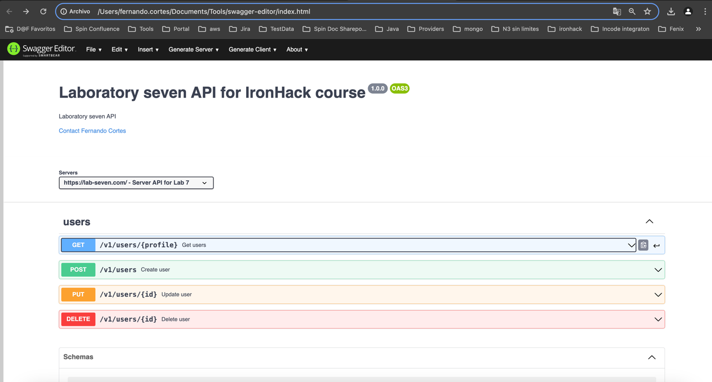
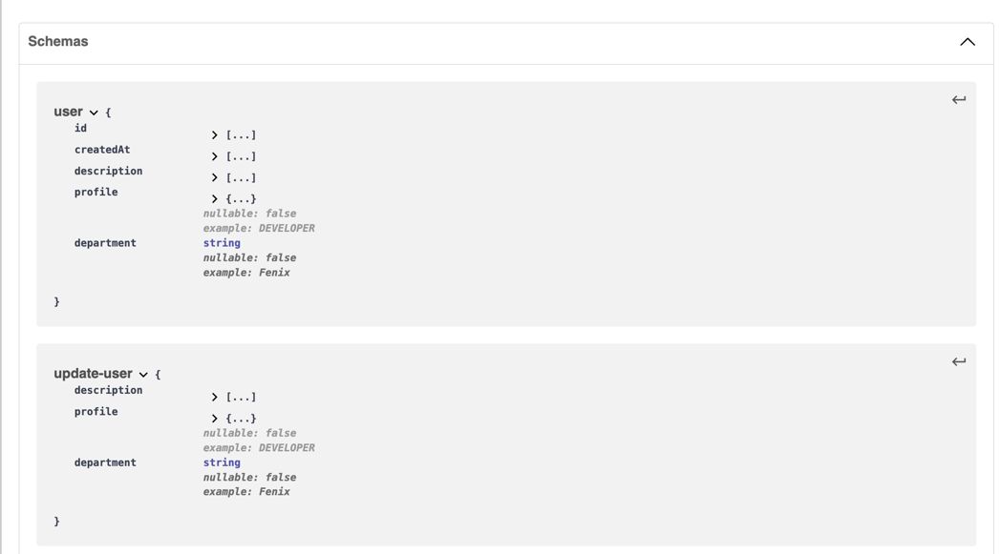
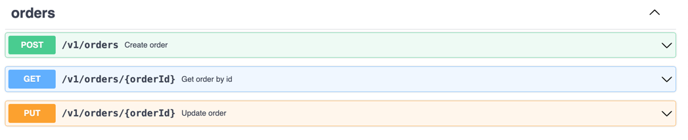
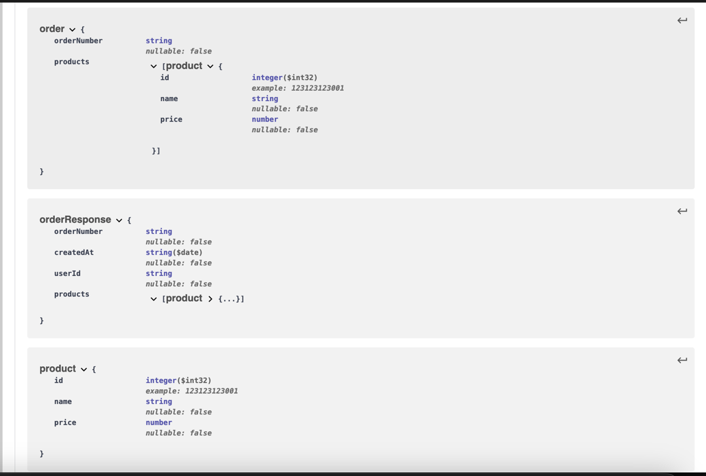

# lab-eight
laboratory eight for Iron Hack course

## API Design Session:

#### Endpoint Design:
* Participants will define RESTful API endpoints for user management, order processing, and customer service interactions.

#### Resource Modeling:
* Define the data structures and resource models required to support the API functionality, such as user profiles, order details, and customer tickets.

#### Documentation:
* Document each API endpoint, specifying required parameters, possible responses, and error codes to ensure clarity and completeness. Emphasis will be placed on adherence to best practices in API documentation to enhance ease of use and maintainability.


## Solution

#### YAML

https://github.com/fernandocortesspin/lab-eight/blob/main/open-api-lab-8.yaml
        
```yaml
openapi: 3.0.0
info:
  version: 1.0.0
  title: Laboratory seven API for IronHack course
  description: Laboratory seven API
  contact:
    name: Fernando Cortes
    email: fernando.cortes@spinbyoxxo.com.mx
servers:
  # Added by API Auto Mocking Plugin
  - description: Server API for Lab 7
    url: https://lab-seven.com/
paths: {
  "/v1/users/{profile}": {
    "get" : {
      "tags": ["users"],
      "summary": "Get users",
      "description" : "Get users",
      "parameters":[
        {
          "name": "profile",
          "in": "path",
          "required": true,
          "schema": { "type": "string", "example": "DEVELOPER" }
        }
      ],
      "responses" : {
        "200" : {
          "description" : "Success",
          "content" : {
            "application/json": {
              "schema" : {
                "type" : "array",
                "items" : {
                  "$ref": "#/components/schemas/user"
                }
              }
            }
          }
        },
        "404" : {
          "description" : "Not found",
          "content" : {
            "application/json": {
              "schema" : {
                "type" : "string"
              }
            }
          }
        },
        "400":{
          "description": "Invalid request"
        },
        "500": {
          "description": "Internal server error"
        }
      }
    }
  },
  "/v1/users": {
    "post" : {
      "tags": ["users"],
      "summary": "Create user",
      "description" : "Create users",
      "requestBody": {
        "content": {
          "application/json": {
            "schema": {
              "$ref": "#/components/schemas/user"
            }
          }
        }
      },
      "responses" : {
        "201" : {
          "description" : "Created",
          "content" : {
            "application/json": {
              "schema" : {
                "type" : "array",
                "items" : {
                  "$ref": "#/components/schemas/user"
                }
              }
            }
          }
        },
        "400":{
          "description": "Invalid request"
        },
        "500": {
          "description": "Internal server error"
        }
      }
    }
  },
  "/v1/users/{id}": {
    "put" : {
      "tags": ["users"],
      "summary": "Update user",
      "description" : "Update user",
      "parameters":[
        {
          "name": "id",
          "in": "path",
          "required": true,
          "schema": { "type": "string", "example": "1231243123" }
        }
      ],
      "requestBody": {
        "content": {
          "application/json": {
            "schema": {
              "$ref": "#/components/schemas/update-user"
            }
          }
        }
      },
      "responses" : {
        "201" : {
          "description" : "Created",
          "content" : {
            "application/json": {
              "schema" : {
                "type" : "array",
                "items" : {
                  "$ref": "#/components/schemas/user"
                }
              }
            }
          }
        },
        "400":{
          "description": "Invalid request"
        },
        "500": {
          "description": "Internal server error"
        }
      }
    },
    "delete" : {
      "tags": ["users"],
      "summary": "Delete user",
      "description" : "Delete user",
      "parameters":[
        {
          "name": "id",
          "in": "path",
          "required": true,
          "schema": { "type": "string", "example": "1231243123" }
        }
      ],
      "responses" : {
        "204" : {
          "description" : "No content"
        },
        "400":{
          "description": "Invalid request"
        },
        "500": {
          "description": "Internal server error"
        }
      }
    }
  },
  "/v1/orders": {
    "post": {
      "tags": [ "orders" ],
      "summary": "Create order",
      "description": "Create order",
      "requestBody": {
        "content": {
          "application/json": {
            "schema": {
              "$ref": "#/components/schemas/order"
            }
          }
        }
      },
      "responses": {
        "201": {
          "description": "Created",
          "content": {
            "application/json": {
              "schema": {
                "type": "array",
                "items": {
                  "$ref": "#/components/schemas/orderResponse"
                }
              }
            }
          }
        },
        "400":{
          "description": "Invalid request"
        },
        "500": {
          "description": "Internal server error"
        }
      }
    }
  },
  "/v1/orders/{orderId}": {
    "get": {
      "tags": [ "orders" ],
      "summary": "Get order by id",
      "description": "Get order by id",
      "parameters":[
        {
          "name": "orderId",
          "in": "path",
          "required": true,
          "schema": { "type": "integer", "example": "123123" }
        }
      ],
      "responses": {
        "200": {
          "description": "Success",
          "content": {
            "application/json": {
              "schema": {
                "type": "array",
                "items": {
                  "$ref": "#/components/schemas/orderResponse"
                }
              }
            }
          }
        },
        "400":{
          "description": "Invalid request"
        },
        "500": {
          "description": "Internal server error"
        }
      }
    },
    "put": {
      "tags": [ "orders" ],
      "summary": "Update order",
      "description": "Update order",
      "parameters":[
        {
          "name": "orderId",
          "in": "path",
          "required": true,
          "schema": { "type": "integer", "example": "123123" }
        }
      ],
      "requestBody": {
        "content": {
          "application/json": {
            "schema": {
              "$ref": "#/components/schemas/order"
            }
          }
        }
      },
      "responses": {
        "200": {
          "description": "Created",
          "content": {
            "application/json": {
              "schema": {
                "type": "array",
                "items": {
                  "$ref": "#/components/schemas/orderResponse"
                }
              }
            }
          }
        },
        "400":{
          "description": "Invalid request"
        },
        "500": {
          "description": "Internal server error"
        }
      }
    }
  }
}
components:
  schemas:
    user:
      type: object
      properties:
        id:
          type: integer
          format: int32
          example: 123123123001
        createdAt:
          type: string
          format: date
        description:
          type: string
          nullable: true
        profile :
          nullable: false
          enum: [DEVOPS, DEVELOPER]
          example: "DEVELOPER"
        department:
          type: string
          nullable: false
          example: "Fenix"
    update-user:
      type: object
      properties:
        description:
          type: string
          nullable: true
        profile :
          nullable: false
          enum: [DEVOPS, DEVELOPER]
          example: "DEVELOPER"
        department:
          type: string
          nullable: false
          example: "Fenix"
    order:
      type: object
      properties:
        orderNumber:
          type: string
          nullable: false
        products:
          type: array
          items: {"$ref": "#/components/schemas/product"}
    orderResponse:
      type: object
      properties:
        orderNumber:
          type: string
          nullable: false
        createdAt:
          type: string
          format: date
          nullable: false
        userId:
          type: string
          nullable: false
        products:
          type: array
          items: { "$ref": "#/components/schemas/product" }
    product:
      type: object
      properties:
        id:
          type: integer
          format: int32
          example: 123123123001
        name:
          type: string
          nullable: false
        price:
          type: number
          nullable: false
```


#### API users




#### API order details





#### Reflection Report:
* A brief report where participants reflect on their design process, discussing:
      
        Designing an API using semantic and open api standards

* The challenges they faced during the API design.
      
        Learn and search about open api docs, to know which are the correct components and attributes

  
* How they applied API First principles to ensure the API was robust and aligned with business needs.
  
        To design this API, following
        - Versioning
        - Semantic
        - Schemes and its types
        - descriptions and documenting components

* Insights gained from the exercise and potential improvements they could make in future API design projects.

       Improvement about document API and  knowledge how it works, open api is a big tool in order to work and document APIS. 
       We can add more details about requests, responses, headers, format and others, to help to client or consumers
